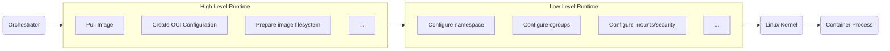

    

# Docker Deep Dive


## VM Workload
We need to isolate the app components from the host environment


## Docker Workload


A practical set of notes covering Docker internals, Linux containers, runtimes, networking, storage, security, OCI, and interview concepts.

# What is Docker?

Docker allows applications to run inside containers by using Linux kernel features to isolate and control processes.

Docker provides mechanisms to:
- Control and isolate system-resource usage of process groups
- Isolate processes
- Isolate the network stack
- Isolate filesystem mount points
- Isolate inter-process communication (IPC)
- Isolate hostname and domain name
- Isolate users and groups


| Linux Technology |  Purpose |
|------------------|----------------|
| Namespaces       | Resource isolation |
| Cgroups	       | Resource control, limits, and accounting |
| Union/Overlay Filesystems | Layered filesystem management


## Evolution of Linux Container Runtimes
The container ecosystem evolved through several important technologies|
- 2008 **LXC** contains combined version of `Linux namespaces` + `Linux control groups (cgroups)` earlier docker default version
- 2014 **Libcontainer** Written in Golang, to communicate directly with the Linux kernel.
- 2015 **runC** formed OCI standards. it became a lightweight, portable implementation for creating and running individual OCI containers
- 2016 **Containerd** extracted core container-management functionality. provides higher level container apis at low-level uses `runC`


**Low Level Container Runtime**
A low-level runtime interacts closely with the Linux kernel. 
- Create a container
- Configure namespaces
- Configure cgroups
- Configure mounts
- Configure capabilities/security settings
- Start the container process
- Destroy the container
  
**High Level Runtime**
manages the broader container lifecycle.
- Pulling images
- Managing image content
- Managing snapshots/storage
- Managing container lifecycle
- Networking integration
- Process supervision



## Main Characteristic of Docker


`shim: A component that integrates running container processes with the higher-level runtime.`

| Characteristic	| Technology |
|-------------------|------------|
| Isolation         |	Linux namespaces |
| Resource control	| Linux cgroups |
| Privilege restriction	| Linux capabilities |
| System-call filtering	| seccomp |
| Mandatory access control	| AppArmor / SELinux |
| Filesystem isolation	| Mount namespaces + filesystem layers |
| Networking	| Linux networking + Docker network drivers|


### Namespace
Linux namespaces provide resource isolation. A container gets its own view of selected system resources while sharing the host kernel
```sh
lsns
```


#### Pid Namespace
provide process isolation. This means processes in different namespaces can have the same PID.

| Without PID Namespace (Host View) | With PID Namespace (Container View) |
| :--- | :--- |
| <pre>Host<br>├── 2 nginx<br>├── 3 mysql<br>└── 4 java</pre> | <pre>Container A<br>└── PID 1 → nginx<br><br>Container B<br>└── PID 1 → java</pre> |


#### Net Namespace
A container utilizing a network namespace receives its own private:
* **Network interfaces**: Dedicated virtual ethernet devices (e.g., `eth0`).
* **IP addresses**: Unique local or private network configurations.
* **Routing tables**: Independent rules for directing outgoing traffic.
* **Firewall rules**: Separate `iptables` or `nftables` connection tracking state.
* **`/proc/net` view**: An isolated view of system networking statistics and metrics.

|Without Network Namespace (Shared) | With Network Namespace (Isolated) |
| :--- | :--- |
| <pre>Host Stack<br>├── eth0 → 192.168.1.50<br>├── App A (Binds to port 80)<br>└── App B (Port conflict if on 80)</pre> | <pre>Container A<br>└── eth0 → 172.17.0.2 (Port 80)<br><br>Container B<br>└── eth0 → 172.17.0.3 (Port 80)</pre> |


#### IPC Namespace
IPC namespaces isolate System V **Inter-Process Communication** objects and POSIX message queues. Processes in one IPC namespace cannot directly access IPC objects belonging to another isolated IPC namespace.
* **System V IPC**: Isolated message queues, semaphore sets, and shared memory segments.
* **POSIX Message Queues**: Isolated network-like message passages between local processes.

| Without IPC Namespace (Shared) | With IPC Namespace (Isolated) |
| :--- | :--- |
| <pre>Host Memory / Queues<br>├── Msg Queue A (Accessible by all)<br>├── Shared Mem B (Accessible by all)<br>└── Conflict if keys duplicate</pre> | <pre>Container A<br>└── Private Msg Queue A (Invisible to B)<br><br>Container B<br>└── Private Shared Mem B (Invisible to A)</pre> |


#### mnt Namespace
Allow different processes to view different file structures, so the file directories seen by each process in are isolated

#### uts Namespace
UTS() allows each to have its own and , allowing it to be regarded as a separate node on the network rather than a process on .

| Without UTS Namespace (Shared) | With UTS Namespace (Isolated) |
| :--- | :--- |
| <pre>Host System<br>└── Hostname: web-server-01<br>    ├── App A (Sees "web-server-01")<br>    └── App B (Sees "web-server-01")</pre> | <pre>Container A<br>└── Hostname: frontend-prod<br><br>Container B<br>└── Hostname: db-replica-01</pre> |


#### user Namespace
Each can have different and , meaning the program can be executed internally by internal users rather than users on .


### Cgroups
Control Groups (cgroups) provide resource control, limits, and accounting for groups of processes

**cgroups** Resource quotas and measurement have been implemented
- *blkio*: This subsystem setting limits the input and output control of each block device. For example: disk, optical disc, and so on.
- *CPU*: This subsystem uses a scheduler to provide access to the task. (For example, in a process , multiple processes simultaneously claim one , which actually divides into multiple time slices and assigns them to different processes to execute.)
- *cpuacct*: Generate resource reports for tasks
- *cpuset*: If it is multi-core, this subsystem will allocate separate memory and memory for the task.
- *devices*: Allow or deny mission access to the device.
- *freezer*: Pause and resume tasks.
- *memory*: Set the memory limits for each and generate memory resource reports.
- *net_cls*: Label each network packet for easy use
- *ns*: Name space subsystem.
- *pid*: Process Identifier Subsystem

```sh
docker inspect <container_name_or_id> --format '{{.HostConfig.CgroupnsMode}}'
stat -fc %T /sys/fs/cgroup

cat  /sys/fs/cgroup/cpu/cpu.shares
cat  /sys/fs/cgroup/cpu/cpu.cfs_period_us
cat /sys/fs/cgroup/cpu/cpu.cfs_quota_us
cat /sys/fs/cgroup/cpu/cpu.stat
cat /sys/fs/cgroup/memory.current
cat /sys/fs/cgroup/memory.max
cat /sys/fs/cgroup/memory.events
```
### Linux CPU Scheduling
Linux uses scheduler mechanisms to determine which runnable tasks receive CPU time. **CFS — Completely Fair Scheduler**

### Syscall filtering 
by **Seccomp** 

### Control Previleged operation
**capabilities:** Limit what a user can do previleged operation
    - mount,
    - kill,
    - chown,...
- `cap_add`
- `cap_drop`

### Filesystem
Union FS allows multiple directories/filesystem layers to appear as one filesystem. and behavior is commonly called Copy-on-Write (CoW). 


Even you deleted the particular file in the Writable layer, but it's present in Readable layer docker uses `whiteout` simply hides it 


```Dockerfile
FROM debian:slim
RUN apt install -y default-jre
RUN wget elasticsearch
RUN untar elasticsearch
COPY /app.jar /app.jar
ENTRYPOINT ["java","app.jar"]
```


| Step 1 | | Step 2 | | Step 3 |
| :---: | :---: | :---: | :---: | :---: |
|  | ➡️ |  | ➡️ |  |


Docker now uses `OverlayFS`
```
                    Container
                        │
                        ↓
                  Merged View
                        │
              ┌─────────┴─────────┐
              ↓                   ↓
        Writable Layer        Image Layers
              │                   │
            R/W                 R/O
                                  │
                         ┌────────┼────────┐
                         ↓        ↓        ↓
                      Layer 3  Layer 2  Layer 1

```

mental model
```
                  Container
                      │
                      ↓
               Merged filesystem
                      │
             ┌────────┴────────┐
             ↓                 ↓
       Writable layer      Read-only layers
             │                 │
             │           ┌─────┴─────┐
             │           ↓           ↓
             │        Layer 2      Layer 1
             │
             ↓
        Copy-on-Write
             │
             ↓
       Modified files

       Deleted lower files
             │
             ↓
          Whiteout

```


### OCI standards
- OCI Image Specification → Defines image format
- OCI Runtime Specification → Defines container runtime behavior/configuration
- OCI Distribution Specification → Defines distribution APIs/protocols

### Docker Networks
- Bridge
  
- None
- Host
- 

## Docker Engine


docker images -a --format='{{.ID}} {{.CreatedAt}} {{.Repository}}:{{.Tag}}'
docker images --format "table {{.Repository}}:{{.Tag}}\t{{.Size}}"
