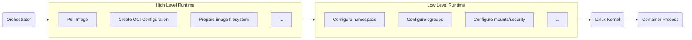

    

# Docker Deep Dive


## VM Workload
We need to isolate the app components from the host environment


## Docker Workload


A practical set of notes covering Docker internals, Linux containers, runtimes, networking, storage, security, OCI, and interview concepts.

# What is Docker?

Docker allows applications to run inside containers by using Linux kernel features to isolate and control processes.

Docker provides mechanisms to:
- Control and isolate system-resource usage of process groups
- Isolate processes
- Isolate the network stack
- Isolate filesystem mount points
- Isolate inter-process communication (IPC)
- Isolate hostname and domain name
- Isolate users and groups


| Linux Technology |  Purpose |
|------------------|----------------|
| Namespaces       | Resource isolation |
| Cgroups	       | Resource control, limits, and accounting |
| Union/Overlay Filesystems | Layered filesystem management


## Evolution of Linux Container Runtimes
The container ecosystem evolved through several important technologies|
- 2008 **LXC** contains combined version of `Linux namespaces` + `Linux control groups (cgroups)` earlier docker default version
- 2014 **Libcontainer** Written in Golang, to communicate directly with the Linux kernel.
- 2015 **runC** formed OCI standards. it became a lightweight, portable implementation for creating and running individual OCI containers
- 2016 **Containerd** extracted core container-management functionality. provides higher level container apis at low-level uses `runC`


**Low Level Container Runtime**
A low-level runtime interacts closely with the Linux kernel. 
- Create a container
- Configure namespaces
- Configure cgroups
- Configure mounts
- Configure capabilities/security settings
- Start the container process
- Destroy the container
  
**High Level Runtime**
manages the broader container lifecycle.
- Pulling images
- Managing image content
- Managing snapshots/storage
- Managing container lifecycle
- Networking integration
- Process supervision



## Main Characteristic of Docker


`shim: A component that integrates running container processes with the higher-level runtime.`

| Characteristic	| Technology |
|-------------------|------------|
| Isolation         |	Linux namespaces |
| Resource control	| Linux cgroups |
| Privilege restriction	| Linux capabilities |
| System-call filtering	| seccomp |
| Mandatory access control	| AppArmor / SELinux |
| Filesystem isolation	| Mount namespaces + filesystem layers |
| Networking	| Linux networking + Docker network drivers|


### Namespace
Linux namespaces provide resource isolation. A container gets its own view of selected system resources while sharing the host kernel
```sh
lsns
```


#### Pid Namespace
provide process isolation. This means processes in different namespaces can have the same PID.

| Without PID Namespace (Host View) | With PID Namespace (Container View) |
| :--- | :--- |
| <pre>Host<br>├── 2 nginx<br>├── 3 mysql<br>└── 4 java</pre> | <pre>Container A<br>└── PID 1 → nginx<br><br>Container B<br>└── PID 1 → java</pre> |


#### Net Namespace
A container utilizing a network namespace receives its own private:
* **Network interfaces**: Dedicated virtual ethernet devices (e.g., `eth0`).
* **IP addresses**: Unique local or private network configurations.
* **Routing tables**: Independent rules for directing outgoing traffic.
* **Firewall rules**: Separate `iptables` or `nftables` connection tracking state.
* **`/proc/net` view**: An isolated view of system networking statistics and metrics.

|Without Network Namespace (Shared) | With Network Namespace (Isolated) |
| :--- | :--- |
| <pre>Host Stack<br>├── eth0 → 192.168.1.50<br>├── App A (Binds to port 80)<br>└── App B (Port conflict if on 80)</pre> | <pre>Container A<br>└── eth0 → 172.17.0.2 (Port 80)<br><br>Container B<br>└── eth0 → 172.17.0.3 (Port 80)</pre> |


#### IPC Namespace
IPC namespaces isolate System V **Inter-Process Communication** objects and POSIX message queues. Processes in one IPC namespace cannot directly access IPC objects belonging to another isolated IPC namespace.
* **System V IPC**: Isolated message queues, semaphore sets, and shared memory segments.
* **POSIX Message Queues**: Isolated network-like message passages between local processes.

| Without IPC Namespace (Shared) | With IPC Namespace (Isolated) |
| :--- | :--- |
| <pre>Host Memory / Queues<br>├── Msg Queue A (Accessible by all)<br>├── Shared Mem B (Accessible by all)<br>└── Conflict if keys duplicate</pre> | <pre>Container A<br>└── Private Msg Queue A (Invisible to B)<br><br>Container B<br>└── Private Shared Mem B (Invisible to A)</pre> |


#### mnt Namespace
Allow different processes to view different file structures, so the file directories seen by each process in are isolated

#### uts Namespace
UTS() allows each to have its own and , allowing it to be regarded as a separate node on the network rather than a process on .

| Without UTS Namespace (Shared) | With UTS Namespace (Isolated) |
| :--- | :--- |
| <pre>Host System<br>└── Hostname: web-server-01<br>    ├── App A (Sees "web-server-01")<br>    └── App B (Sees "web-server-01")</pre> | <pre>Container A<br>└── Hostname: frontend-prod<br><br>Container B<br>└── Hostname: db-replica-01</pre> |


#### user Namespace
Each can have different and , meaning the program can be executed internally by internal users rather than users on .


### Cgroups
Control Groups (cgroups) provide resource control, limits, and accounting for groups of processes

**cgroups** Resource quotas and measurement have been implemented
- *blkio*: This subsystem setting limits the input and output control of each block device. For example: disk, optical disc, and so on.
- *CPU*: This subsystem uses a scheduler to provide access to the task. (For example, in a process , multiple processes simultaneously claim one , which actually divides into multiple time slices and assigns them to different processes to execute.)
- *cpuacct*: Generate resource reports for tasks
- *cpuset*: If it is multi-core, this subsystem will allocate separate memory and memory for the task.
- *devices*: Allow or deny mission access to the device.
- *freezer*: Pause and resume tasks.
- *memory*: Set the memory limits for each and generate memory resource reports.
- *net_cls*: Label each network packet for easy use
- *ns*: Name space subsystem.
- *pid*: Process Identifier Subsystem

```sh
docker inspect <container_name_or_id> --format '{{.HostConfig.CgroupnsMode}}'
stat -fc %T /sys/fs/cgroup

cat  /sys/fs/cgroup/cpu/cpu.shares
cat  /sys/fs/cgroup/cpu/cpu.cfs_period_us
cat /sys/fs/cgroup/cpu/cpu.cfs_quota_us
cat /sys/fs/cgroup/cpu/cpu.stat
cat /sys/fs/cgroup/memory.current
cat /sys/fs/cgroup/memory.max
cat /sys/fs/cgroup/memory.events
```
### Linux CPU Scheduling
Linux uses scheduler mechanisms to determine which runnable tasks receive CPU time. **CFS — Completely Fair Scheduler**

### Syscall filtering 
by **Seccomp** 

### Control Previleged operation
**capabilities:** Limit what a user can do previleged operation
    - mount,
    - kill,
    - chown,...
- `cap_add`
- `cap_drop`

### Filesystem
Union FS allows multiple directories/filesystem layers to appear as one filesystem. and behavior is commonly called Copy-on-Write (CoW). 


Even you deleted the particular file in the Writable layer, but it's present in Readable layer docker uses `whiteout` simply hides it 


```Dockerfile
FROM debian:slim
RUN apt install -y default-jre
RUN wget elasticsearch
RUN untar elasticsearch
COPY /app.jar /app.jar
ENTRYPOINT ["java","app.jar"]
```


| Step 1 | | Step 2 | | Step 3 |
| :---: | :---: | :---: | :---: | :---: |
|  | ➡️ |  | ➡️ |  |


Docker now uses `OverlayFS`
```
                    Container
                        │
                        ↓
                  Merged View
                        │
              ┌─────────┴─────────┐
              ↓                   ↓
        Writable Layer        Image Layers
              │                   │
            R/W                 R/O
                                  │
                         ┌────────┼────────┐
                         ↓        ↓        ↓
                      Layer 3  Layer 2  Layer 1

```

mental model
```
                  Container
                      │
                      ↓
               Merged filesystem
                      │
             ┌────────┴────────┐
             ↓                 ↓
       Writable layer      Read-only layers
             │                 │
             │           ┌─────┴─────┐
             │           ↓           ↓
             │        Layer 2      Layer 1
             │
             ↓
        Copy-on-Write
             │
             ↓
       Modified files

       Deleted lower files
             │
             ↓
          Whiteout

```


### OCI standards
- OCI Image Specification → Defines image format
- OCI Runtime Specification → Defines container runtime behavior/configuration
- OCI Distribution Specification → Defines distribution APIs/protocols

### Docker Networks
- Bridge
  
- None
- Host
- 

## Docker Engine


# Docker commands

## Build 
```bash
# Standard image build using the current directory as context
docker build -t my-app:latest .

# Modern BuildKit build (default in modern Docker versions) with faster caching
DOCKER_BUILDKIT=1 docker build -t my-app:latest .

```
### Specific file & .dockerignore & Logs 
```bash
# Build using a custom named Dockerfile instead of the default 'Dockerfile'
docker build -f Dockerfile.dev -t my-app:dev .

# Build with raw logs streamed completely without terminal formatting or wrapping
docker build --progress=plain -t my-app:latest .

# Example of a `.dockerignore` file concept to skip node_modules and git metadata:
# Prevents large, unnecessary local files from bloating the build context.
# Contents of .dockerignore:
# .git
# node_modules/
# *.log
```
### build by platform
```bash
# Build an image targeted for a specific platform architecture
docker build --platform linux/amd64 -t my-app:amd64 .

# Build for multiple target architectures simultaneously using Docker Buildx (requires a builder instance)
docker buildx create --name mybuilder --use
docker buildx build --platform linux/amd64,linux/arm64 -t username/my-app:v1.0 --push .
```
### organize by tag labels
```bash
# Tag an existing image with a precise semantic version and a moving 'latest' alias
docker tag my-app:latest ://my-registry.com
docker tag my-app:latest ://my-registry.com

# Embed non-reusable structural metadata (labels) directly during the build phase
docker build --label "maintainer=devops@company.com" --label "build_version=v1.2.4" --label "environment=production" -t my-app:latest .
```

### ARG vs ENV
- *ARG* (Build-time): Only available while the image is building. It is completely absent once the container starts running.
- *ENV* (Runtime): Available during the build AND persists inside the running container as an environment variable.

```bash
# Dockerfile snippet showcasing the differences:
# ARG VERSION=16
# FROM node:${VERSION}                  <- ARG used to pick base image
# ENV NODE_ENV=production               <- ENV set for the final container application

# Override a build-time argument from the command line interface
docker build --build-arg VERSION=18 -t my-node-app .

# 1. This WILL override the internal ENV (NODE_ENV will now be 'development' inside)
docker container run -d -e NODE_ENV=development my-node-app
```

### ADD vs COPY
- *COPY* (Recommended): Explicitly copies local files or folders from the host machine context straight into the container.
- *ADD*: Copies files but includes advanced logic. It automatically extracts local tar archives into directories and downloads files directly from remote URLs
```bash
# Dockerfile snippet showcasing the behavior:
# COPY package.json /app/              <- Safest, default practice for standard assets
# ADD sourcecode.tar.gz /app/          <- Automatically extracts the tarball into /app/
# ADD https://example.com /   <- Downloads file directly into container root
```
### ENTRYPOINT vs RUN
- *RUN* (Build-time): Executes commands inside a temporary layer to modify the file system (e.g., installing packages) during the build process.
- *ENTRYPOINT* (Runtime): Configures the concrete executable command that fires up by default the moment the container transitions to a running state.

```bash
# Dockerfile snippet showcasing the mechanics:
# RUN apt-get update && apt-get install -y curl  <- Executed during 'docker build'
# ENTRYPOINT ["curl", "-s"]                      <- Executed during 'docker run'

# Usage mapping at runtime:
# Passing an argument appends seamlessly to the ENTRYPOINT executable
docker run --rm my-curl-image https://github.com
```

### INIT
Basically, primary application executable that fires up by default `ENTRYPOINT` the moment the container transitions to a running state. It defines the core purpose of the container.

`INIT` Injects a lightweight init system (like `tini`) into the container to run as PID 1, moving your ENTRYPOINT application to PID 2+.Containers running complex apps (like Node.js, Java, or multiple background processes) often fail to respond to docker stop or clean up dead child processes. The `--init` flag resolves this completely.

```
Without --init:  [PID 1: Your App]      <-- Frequently ignores SIGTERM / leaves zombie processes
With --init:     [PID 1: Tini Init] -> [PID 2: Your App]  <-- Properly reaps zombies & handles signals

# Force Docker to use an init process to safely reap zombie processes
docker container run -d --init --name safe-app my-node-image

# Stop the container instantly (Init forwards SIGTERM properly, avoiding the 10-second timeout)
docker container stop safe-app
```

### MultiStage Build

```bash
# --- Stage 1: The Builder Environment ---
FROM golang:1.21 AS builder
WORKDIR /src
COPY . .
# Compile a single static binary file
RUN CGO_ENABLED=0 GOOS=linux go build -o myapp .

# --- Stage 2: The Production Runtime ---
FROM alpine:latest  
RUN apk --no-cache add ca-certificates
WORKDIR /root/
# Securely extract only the compiled binary file from the previous stage
COPY --from=builder /src/myapp .
# Define final container initialization executable
ENTRYPOINT ["./myapp"]
```
```bash
# Build the multi-stage pipeline (Docker naturally discards Stage 1 bulk layers)
docker build -t production-app:latest .

# Stop the build execution early at a specific targeting layer for debugging
docker build --target builder -t debug-builder:latest .
```


## Image
### query by label
```bash
# Filter and list images matching a specific maintainer label
docker image ls --filter "label=maintainer=devops@company.com"

# Filter and list images containing a specific build stage metadata label
docker image ls --filter "label=stage=builder"

# Remove all images that have a specific deployment label applied
docker image rm $(docker image ls -q --filter "label=environment=staging")

# Custom output format showing IDs, creation timestamps, and repository tags for all images
docker images -a --format='{{.ID}} {{.CreatedAt}} {{.Repository}}:{{.Tag}}'
```
### Image layers & History
```bash
# View the linear build history and structural layers of an image
docker image history nginx

# View build history with full-length command descriptions instead of truncated text
docker image history --no-trunc nginx

# View only the specific text layer sizes of an image to find storage bottlenecks
docker image history --format "{{.CreatedBy}}: {{.Size}}" nginx
```
### Inspect & Metadata
```bash
# Extract and view the complete raw metadata configuration JSON schema
docker image inspect nginx

# Extract specific structural details using Go template formatting syntax
docker image inspect -f '{{.Architecture}}' nginx                 # View CPU architecture (amd64/arm64)
docker image inspect -f '{{.Config.Env}}' nginx                 # List default internal environment variables
docker image inspect -f '{{.Config.Cmd}}' nginx         -        # View default startup execution command


# Format standard image listing into a clean, customized data table showing tags and file sizes
docker images --format "table {{.Repository}}:{{.Tag}}\t{{.Size}}"
```

```bash
docker image inspect nginx
```
### Push & Pull registry
```bash
# Authenticate securely with a target image registry provider
docker login ://example.com -u your_username

# Tag an existing local image structure to match target registry paths
docker image tag nginx:latest ://example.com/production/nginx:v1.0

# Push the newly tagged local architecture up to the secure remote repository
docker image push ://example.com/production/nginx:v1.0

# Pull down an update package without launching a container runtime interface
docker image pull ://example.com/production/nginx:v1.0
```
### Prune & Clean up
```bash
# Remove a specific targeted image variant completely from host disks
docker image rm nginx:latest

# Remove all dangling images (images that are untagged and not used by any container)
docker image prune

# Deep clean: remove ALL images not currently associated with an active running container
docker image prune -a

# Automatically clean up images based on age conditions (e.g., older than 48 hours)
docker image prune -a --filter "until=48h"
```

## Container
### Lifecycle & States
```sh
docker container run nginx -d # detached; run in background
docker container run --name webserver nginx   # with custom-name 
docker container ls -a
docker ps -a

docker container stop webserver         # stop the container
docker container start  webserver       # start the container
docker container stats webserver        # statistics
docker container inspect webserver      # inspect

docker container rm  webserver          # only stopped container can be removed
docker container rm CONTAINER_NAME --force  # May the Force be with you 
```
### Port mapping & Publish
```bash
docker container run -d --name nginx nginx  # create nginx container
docker container run -d --name my-app alpine/curl  # curl container

# test the container from curl -> nginx
docker container exec -it my-app sh
curl <IP-OF-NGINX-CONTAINER>:80       # docker inspect -f '{{range.NetworkSettings.Networks}}{{.IPAddress}}{{end}}' nginx

# remove the nginx container and publish new container with published port
docker container rm nginx --force  
docker container run -d --name nginx -p 8080:80 nginx
```
```
     -p   8080     :        80
            │                │
    ┌───────┴──────┐ ┌───────┴──────────┐
    │  Host Port   │ │  Container Port  │
    │ (Your Laptop)│ │ (Inside Nginx)  │
    └──────────────┘ └──────────────────┘
```


### Logs & Monitoring
```bash
docker container logs nginx             # view all logs
docker container logs -f nginx          # follow/stream logs in real-time
docker container logs --tail 10 nginx   # view only the last 10 lines
docker container top nginx              # list running processes inside container
docker container stats nginx            # live stream of CPU, memory, and network usage
```
### Environment variables
```bash
# pass a single environment variable
docker container run -d --name my-db -e MYSQL_ROOT_PASSWORD=secret mysql

# pass multiple variables using an env file
echo "DB_USER=admin\nDB_PASS=password" > .env
docker container run -d --name app --env-file .env alpine
```
### Exec & Interactive terminal
```bash
docker container exec nginx ls -l
docker container exec -it nginx bash
```
### Restart policies
```bash
docker container run -d --restart no nginx             # default; do not restart
docker container run -d --restart on-failure nginx    # restart only if container exits with error
docker container run -d --restart always nginx        # always restart, even if stopped manually
docker container run -d --restart unless-stopped nginx # restart unless explicitly stopped by user
```
### Capabilities & Privileges
```bash
# grant full root privileges to the host system (use with caution)
docker container run -d --privileged --name secure-app nginx

# add specific Linux kernel capabilities (e.g., allow system clock modifications)
docker container run -d --cap-add=SYS_TIME --name time-app alpine

# drop specific Linux kernel capabilities for hardened security
docker container run -d --cap-drop=CHOWN --name hardened-app alpine
```

### Resource limits (CPU & Memory)
```bash
# limit maximum memory allocation to 512 Megabytes
docker container run -d --memory="512m" nginx

# limit maximum CPU usage to 1.5 cores
docker container run -d --cpus="1.5" nginx

# set memory limit along with swap memory allocation
docker container run -d --memory="512m" --memory-swap="1g" nginx
```
### Healthchecks & Init processes
```bash
# configure internal healthcheck intervals and rules
docker container run -d  --name health-web  --health-cmd="curl -f http://localhost/ || exit 1"   --health-interval=5s   --health-timeout=3s   --health-retries=3 nginx

# run with pid 1 init process to forward signals and reap zombie processes
docker container run -d --init --name init-app alpine
```


## Volume

### Named volumes
Managed entirely by Docker, isolated from host machine file structures, and persistent across container lifecycles
```bash
docker volume create my-data            # create a named volume explicitly
docker volume ls                        # list all available volumes
docker volume inspect my-data           # view storage location on host system

# mount the named volume to the container target directory
docker container run -d --name web -v my-data:/usr/share/nginx/html nginx
```

```
     -p   my-data   :     /usr/share/nginx/html
            │                │
    ┌───────┴──────┐ ┌───────┴──────────┐
    │      Host    │ │  Container       │
    │ (Your Laptop)│ │ (Inside Nginx)   │
    └──────────────┘ └──────────────────┘
```

### Bind mounts
Maps an exact, absolute path on your host machine directly to a path inside the running container.
```bash
# mount local development directory to nginx server using modern --mount flag
docker container run -d --name dev-web \
  --mount type=bind,source="$(pwd)"/html,target=/usr/share/nginx/html \
  nginx

# short syntax alternate version using absolute path variable
docker container run -d --name dev-web-alt -v "$(pwd)"/html:/usr/share/nginx/html nginx
```
### Anonymous volumes
Created dynamically without an explicit name when a container is run; automatically deleted if the container is removed with the `-v` flag
```bash
# generate a dynamic hash-named volume for temporary, high-performance storage
docker container run -d --name temp-app -v /data alpine

# cleanup container and its associated anonymous volumes at the same time
docker container rm -v temp-app
```
### Volume drivers
Allows Docker to bypass local storage and mount external storage systems like AWS S3, Azure Files, DigitalOcean block storage, or SSH/NFS shares directly
```bash
# install a cloud storage volume driver (example using local NFS share setup)
docker volume create --driver local --opt type=nfs --opt o=addr=192.168.1.50,rw --opt device=: /path/to/nfs/share  nfs-volume
```

```bash
# 1. Install the official managed Rclone volume plugin
docker plugin install rclone/docker-volume-plugin:latest --grant-all-permissions

# 2. Create the volume passing S3 parameters via driver options (--opt)
docker volume create --driver rclone/docker-volume-plugin --opt type=s3 --opt s3-provider=AWS --opt s3-access-key-id=YOUR_ACCESS_KEY --opt s3-secret-access-key=YOUR_SECRET_KEY --opt s3-region=us-east-1 --opt vfs-cache-mode=full s3-volume:your-bucket-name
```

### Backup & Restore
Uses a temporary intermediary container to archive or extract volumes back onto your system
```bash
# Backup: archive 'my-data' contents into a compressed tar file on the host machine
docker container run --rm -v my-data:/volume -v "$(pwd)":/backup alpine tar cvf /backup/backup.tar /volume

# Restore: extract the backup tar file contents back into a new volume
docker container run --rm -v new-data:/volume -v "$(pwd)":/backup alpine tar xvf /backup/backup.tar -C /volume --strip-components=1
```


## Secrets
### Build-time secrets
### Compose secrets
### Vault integration


## Network
### Bridge network
### Host network
### Overlay network
### Custom networks
### DNS & Service discovery


