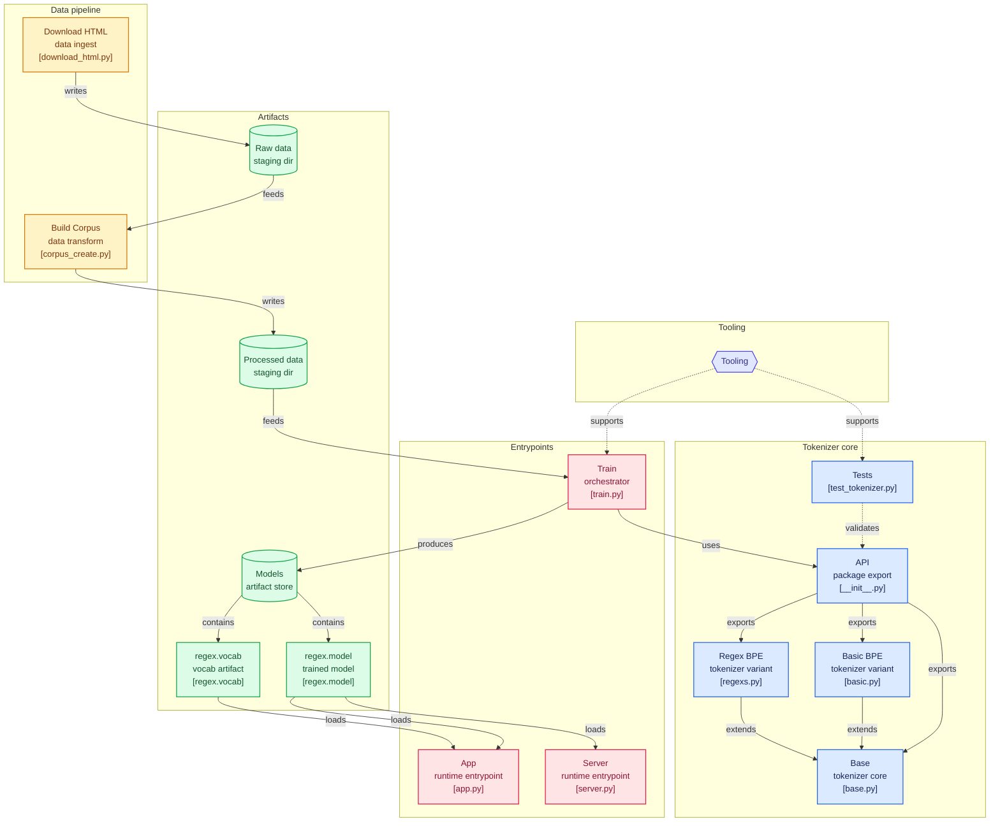

---
title: "Tamil Tokenizers"
published: true
categories:  projects
author_profile: true
layout: single
classes:
- landing_page
toc: true
toc_sticky: true
categories:  projects
date: 2024-07-05
related: false
mermaid: true
header:
    teaser: "/../assets/project-tamil-tokenizers/tamil_tokenizer.png"
--- 

# Language Behind Large Language Models

Project URL: [Tamil Tokenizers](https://github.com/Muthukamalan/TamilTokenizers)


# Introduction

When we ask ChatGPT or Claude a question, the sentence doesn't go into the model directly. It's first broken down into small units called tokens. The process that does this is called tokenization, and the component responsible is the tokenizer.

A language model doesn't actually understand words — it only understands numbers. So the first step of turning text into numbers is tokenization. Get this step wrong, and it affects the model's capability, speed, and cost.


# What is a Token?
A token can be a whole word, part of a word, or even a single character. For example:

```
"unhappiness" → ["un", "happi", "ness"]  
"tokenization" → ["token", "ization"]
```
The granularity of this split has real consequences downstream — for how much context a model can hold, how fast it runs, and how much it costs to run.


## Types of Tokenization
- I. **Word-based** <br>
Each word is one token. Simple, but the vocabulary grows huge, and it can't handle words it hasn't seen before (out-of-vocabulary problem).

- II. **Character-based**
Each character is one token. Vocabulary stays small, but a sentence turns into a very long sequence of tokens — which increases compute cost.

- III. Subword-based — today's standard
This strikes a balance between the two. Common words stay whole, while rare words get split into smaller pieces. Three main algorithms dominate here:

    - 3.1 **BPE** (Byte Pair Encoding)
    Repeatedly merges the most frequently occurring pairs of characters to build a vocabulary. Computationally simple, but can ignore linguistic meaning.

    - 3.2 WordPiece
    Similar to BPE, but instead of picking the most frequent pair, it picks the pair that maximizes the likelihood of the training data.

    - 3.3 SentencePiece
    Doesn't require language-specific pre-processing like whitespace splitting — this matters a lot for languages where word boundaries aren't as clear-cut as in English. Can run on either a Unigram language model or BPE underneath.

# Why build a tokenizer from scratch?


Most of us just import a tokenizer and move on. But if you actually want to understand what's happening under the hood — especially for a script like Tamil, where general-purpose tokenizers tend to over-fragment text — the only real way is to build one yourself, watch it merge, and see the vocabulary grow one pair at a time.

That's exactly what TamilTokenizers does. It's a small, focused project that takes raw Tamil web text all the way through to a trained byte-level BPE tokenizer, wraps it in a FastAPI service, and gives you a Gradio UI to visually inspect how a sentence gets split into tokens.


### What's in the repo
The project is organized as a clean pipeline rather than a single notebook:
```sh
.
├── data
│   ├── download_html.py     # fetches raw HTML sources
│   ├── corpus_create.py     # extracts + cleans Tamil text
│   ├── raw/
│   └── processed/
├── minbpe
│   ├── base.py               # core BPE tokenizer logic
│   ├── basic.py               # plain byte-level BPE
│   ├── regexs.py              # regex-chunked BPE variant
│   └── test_tokenizer.py
├── models
│   ├── regex.model            # trained merges/config
│   └── regex.vocab            # human-readable vocab dump
├── train.py                    # training entrypoint
├── server.py                   # FastAPI inference service
├── app.py                       # Gradio visualizer
└── Dockerfile
```

## Architecture Diagram




## Step to Build

#### Step 1: Building a Tamil-only corpus

The data pipeline is intentionally simple. download_html.py pulls down raw HTML pages, and corpus_create.py parses them with BeautifulSoup, keeping only characters that fall inside the Tamil Unicode block. The cleaned result lands in data/processed/tamil_corpus.txt, which becomes the sole training input.

This matters more than it looks. Feeding a tokenizer a corpus littered with HTML tags, English boilerplate, and stray symbols means it wastes merge operations learning junk patterns instead of actual Tamil structure. Restricting to the Tamil Unicode range up front keeps the vocabulary focused.

####  Step 2: Training with a regex-aware BPE tokenizer

The core tokenizer logic lives in minbpe, structured with a base.py that both basic.py (plain byte-pair BPE) and regexs.py (regex-chunked BPE) extend.
The RegexTokenizer is the one actually used for training:

```python
from minbpe import RegexTokenizer

fpath = "./data/processed/tamil_corpus.txt"
text = open(fpath, "r", encoding="utf-8").read()

tokenizer = RegexTokenizer()
tokenizer.train(text, vocab_size=1000, verbose=True)
tokenizer.save("models/regex")
```

The key detail is the Tamil-specific chunking pattern ([\u0B80-\u0BFF]+) used before running byte-pair merges. Rather than treating the whole corpus as one undifferentiated byte stream — the way vanilla BPE would — it first groups text into Tamil-script chunks, then learns merges within that structure. This is the same intuition behind GPT-2's regex pre-tokenization, but re-tuned for Tamil's Unicode range instead of English word boundaries.

Training with vocab_size=1000 produces two artifacts:

```sh
regex.model — the serialized merge rules
regex.vocab — a human-readable dump of the learned vocabulary
```

#### Step 3: Serving it

Once trained, the tokenizer is loaded straight from disk:

```python
from minbpe import RegexTokenizer

tokenizer = RegexTokenizer()
tokenizer.load("./models/regex.model")

text = "சிந்தாமணி சிலப்பதிகாரம்"
ids = tokenizer.encode(text)
decoded = tokenizer.decode(ids)
```

server.py wraps this in a FastAPI endpoint, POST /encode, that returns token IDs alongside per-token byte and text breakdowns:

```sh
curl -X POST "http://localhost:8000/encode" -H "Content-Type: application/json" -d '{"text":"தமிழ் மொழி அழகு"}'
```

```json
{
  "token_ids": [...],
  "token_details": [
    {"token_id": 123, "token_bytes": "b'...'", "token_text": "..."}
  ],
  "full_text": "..."
}
```

A Dockerfile is included so the whole thing can be built and run as a container, which is the practical path if you want this running as a standalone service rather than a local script.


#### Step 4: Seeing it, not just running it

The part that makes this project genuinely useful for learning is app.py — a Gradio app that loads the same regex.model and renders tokenized text with each token color-coded. Instead of squinting at a list of integers, you actually see where the tokenizer decided to draw boundaries inside a Tamil sentence. For anyone trying to build intuition about subword tokenization on a non-Latin script, that visual feedback loop is worth more than reading the algorithm on paper.


# **Conclusion**
The tokenizer is like an iceberg below the waterline — we rarely think about it, but it quietly determines a model's capability and how fairly it serves different languages. If AI is going to serve every language equitably, that work has to start at the tokenizer level.