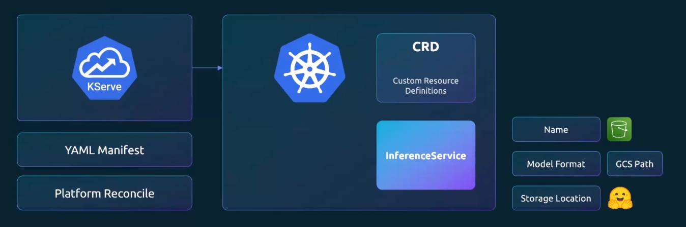
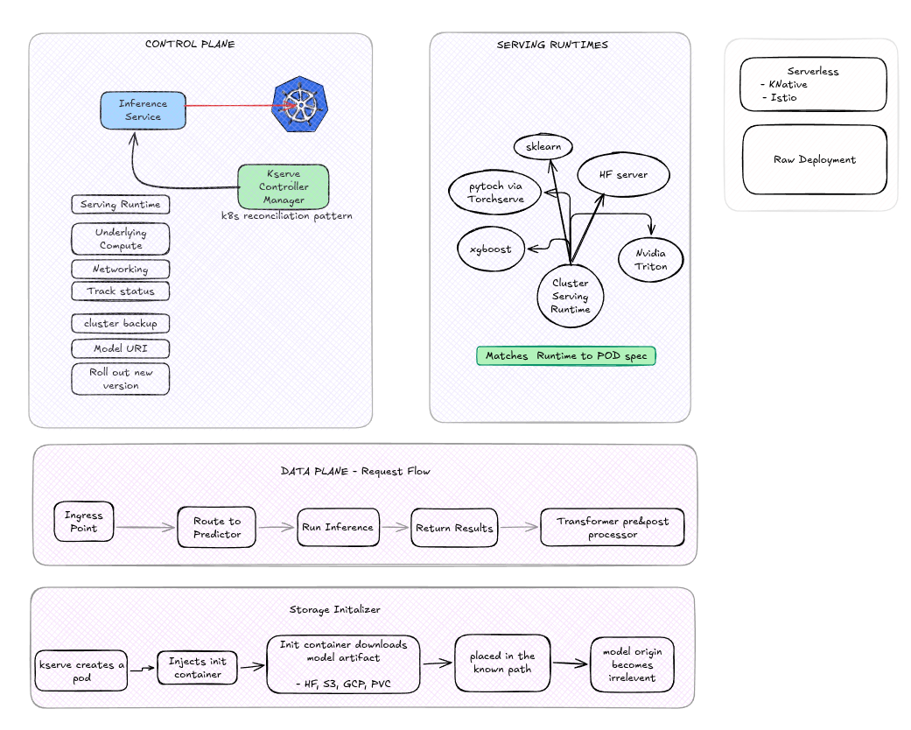
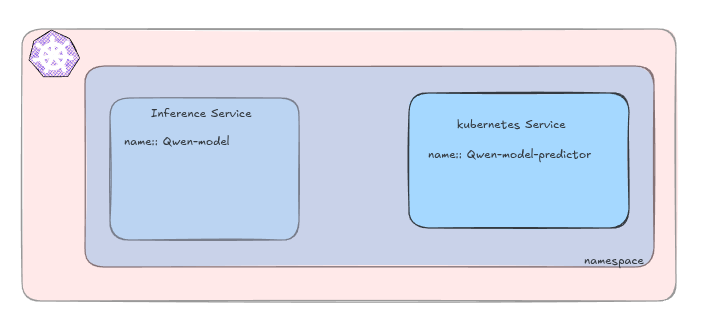

+++
date = "2026-05-04 1:01:35"
title = "k8S ❤️ KServe"
description = "Let's Serve better with KServe"

[taxonomies]
tags = ["Bash","KServe", "AI/ML","Kubernets"]

[extra]
local_image = 'images/thumbnails/blog/kserve.png'
quick_navigation_buttons = true
toc= false
+++


<details>
    <summary>Table Of Content</summary>
    <!-- toc -->
</details>

# Serving ML Models on Kubernetes with KServe
 
Deploying a trained model is often harder than training it. You need an API endpoint, autoscaling, health checks, request batching, and a way to handle both lightweight predictive models and heavyweight generative ones — without writing bespoke infrastructure for each. **KServe** solves this by giving you a standard, Kubernetes-native way to serve models of any kind.
 
This post walks through what KServe is, how it's architected, and how to install it and deploy your first models.
 

## Prerequisites
 
- `kubectl` — configured with access to a Kubernetes cluster
- `helm` (v3+)
- A Kubernetes cluster (local via kind/minikube, or a managed cluster)
---


## What Is Model Serving?
 
Model serving is the process of taking a trained model and making it usable in production. At a high level, it involves:
 
1. **Loading the model into memory** so it's ready to handle requests
2. **Exposing an API endpoint** (HTTP or gRPC) that clients can call
3. **Handling the request lifecycle** — preprocessing input, tokenization, running inference, and postprocessing output
4. **Managing operational concerns** — batching concurrent requests, health checks, and graceful restarts/rollouts
Serving needs differ significantly depending on the type of model:
 
| | Predictive Models | Generative Models |
|---|---|---|
| **Output** | A single output per input (e.g. a class label, a score) | A stream of tokens, generated one at a time until an end token |
| **Resource usage** | Typically lightweight, CPU-friendly | Compute-heavy, usually GPU-bound, and latency-sensitive due to streaming |
 
This distinction matters because a serving platform built only for one type (say, small scikit-learn models) won't scale well to something like an LLM — and vice versa.
 
---

## Why KServe?
 
A few realities make model serving on Kubernetes genuinely hard to do by hand:
 
- **Models are resource-hungry.** GPUs and large memory footprints are the norm, especially for generative models.
- **Scale is unpredictable.** Traffic can spike or drop suddenly, and you need to scale (including to/from zero) without manual intervention.
- **You rarely run just one model.** Most real deployments serve many models, often of different frameworks and formats.
- **Open-weight models don't simplify serving.** Downloading a model from Hugging Face is the easy part — production-grade serving (batching, routing, autoscaling, observability) is still on you.
KServe addresses this by providing a Kubernetes Custom Resource Definition (CRD), `InferenceService`, that abstracts away the deployment details. You describe *what* you want to serve; KServe handles *how*.
 
---
 
## Kserve Architecture
KServe sits on top of Kubernetes and (optionally) a service mesh/ingress layer, and is built around a controller that reconciles `InferenceService` resources into running deployments.


 

**Core components:**



---
## Installation

KServe is installed via Helm in three layers: CRDs, the core controller, and runtime configs.
 
```sh
# kserve-crds:: Core KServe CRDs ( InferenceService, TrainedModel )
helm install kserve-crd oci://ghcr.io/kserve/charts/kserve-crd --version v0.19.0

# custom resource definitions:: LLM-specific LLMInferenceService
helm install kserve-llmisvc-crd oci://ghcr.io/kserve/charts/kserve-llmisvc-crd --version v0.19.0

# install kserve
# -- no Istio Service mesh or ingress controller::  avoids requiring Istio/Knative — runs as plain Kubernetes Deployments
helm install kserve oci://ghcr.io/kserve/charts/kserve-resources --version v0.19.0 --namespace kserve --create-namespace --set kserve.controller.deploymentMode=RawDeployment
```
<br>

####   Verify the controller is up
```sh
# Check Status
kubectl rollout status deployment/kserve-controller-manager -n kserve

# install runtime configs
# - servingruntime.enabled=true ;; Serving runtimes are opt-in
helm install kserve-runtime-configs oci://ghcr.io/kserve/charts/kserve-runtime-configs \
    --version v0.19.0 \
    --namespace kserve \
    --set kserve.servingruntime.enabled=true \                      
    --set kserve.controller.gateway.disableIstioVirtualHost=true \
    --set kserve.controller.gateway.disableIngressCreation=true

helm status kserve-runtime-configs -n kserve
helm get all kserve-runtime-configs -n kserve

kubectl get pods -n kserve

kubectl get crds | grep kserve
kubectl get clusterservingruntimes
```

---

## Deploying Your First Models



1. Namespace

`kserve-inference` namespace created.
```yaml
# kserve_ns.yaml
apiVersion: v1
kind: Namespace
metadata:
  name: kserve-inference
```
---
2. Qwen2 model as generative-model example. 
```yaml
# qwen2_small.yaml
apiVersion: serving.kserve.io/v1beta1
kind: InferenceService
metadata:
    name: qwen-model
    namespace: kserve-inference
spec:
    predictor:
        model:
            modelFormat:
                name: huggingface
            storageUri: "hf://Qwen/Qwen2.5-0.5B-Instruct"
            args:
                - --backend=huggingface
            resources:
                requests:
                    cpu: "1"
                    memory: "2Gi"
                limits:
                    cpu: "2"
                    memory: "6Gi"
```

---

3. Sklearn Iris model as predictive model example.
```yaml
# iris.yaml
apiVersion: serving.kserve.io/v1beta1
kind: InferenceService
metadata:
    name: sklearn-iris
    namespace: kserve-inference
spec:
    predictor:
        model:
            modelFormat:
                name: sklearn
            storageUri: https://storage.googleapis.com/kfserving-examples/models/sklearn/1.0/model/model.joblib
```


```yaml
# bert-classifier.yaml
apiVersion: serving.kserve.io/v1beta1
kind: InferenceService
metadata:
  name: sentiment-classifier
spec:
  predictor:
    model:
      modelFormat:
        name: huggingface
      storageUri: hf://distilbert/distilbert-base-uncased-finetuned-sst-2-english
      args:
        - --model_name=sentiment-classifier
        - --task=sequence_classification
        - --backend=huggingface
        - --return_probabilities
      resources:
        requests:
          cpu: 1
          memory: 2Gi
        limits:
          cpu: 2
          memory: 4Gi

```

<br>

The KServe controller watches `InferenceService` objects, picks the matching `ClusterServingRuntime` for the model format, provisions the necessary compute, wires up networking, and reports status back — following the standard Kubernetes reconciliation pattern.


```sh
# Wait for the model to become ready
kubectl wait --for=condition=Ready --timeout=10m inferenceservice/sklearn-iris -n kserve-test
kubectl describe pod/PODSNAME -n kserve-test
kubectl get deployment,service -n kserve-test

# port forwarding
kubectl port-forward -n kserve-test svc/sklearn-iris-predictor 8080:80


# check
kubectl get inferenceservice qwen-model -n kserve-inference
kubectl get pods -n kserve-inference -w
```


---
## Calling the Inference API
 
KServe's generative model runtimes expose an OpenAI-compatible chat completions endpoint:
 
```sh
# Generative
POST /openai/v1/chat/completion
- modelname
- list_of_messages
- max_tokens

# Predictive
POST /v2/models/MODEL_NAME/infer
- name
- shape
- data-type
- data


# call api
curl -s http://localhost:8080/openai/v1/chat/completions -H "Content-Type: application/json" -d '{"model":"qwen-model", "messages":"{"role":"user","content":"What is Kserve?"}", "max_tokens":100 }' | jq

curl -s http://localhost:8080/v2/models/sentiment-classifier/infer -H "Content-Type: application/json" -d '{"inputs": [{"name": "input-0","shape": [1],"datatype": "BYTES","data": This course was delightful. The labs taught me how to serve ML models and query them."]}]}' | jq .
```

---
## Uninstall
```sh
helm uninstall kserve --namespace kserve
helm uninstall kserve-runtime-configs --namespace kserve
helm uninstall kserve-crd
helm uninstall kserve-llmisvc-crd
```

---

## Conclusion
 
KServe gives you a single, declarative interface (`InferenceService`) for serving both lightweight predictive models and heavyweight generative ones on Kubernetes — without hand-rolling autoscaling, batching, or health-check logic yourself. Once the controller and runtimes are installed, deploying a new model is often just a matter of writing a short YAML manifest pointing at a model artifact.
 