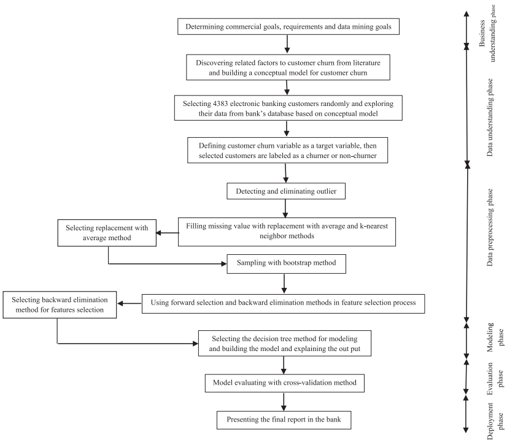
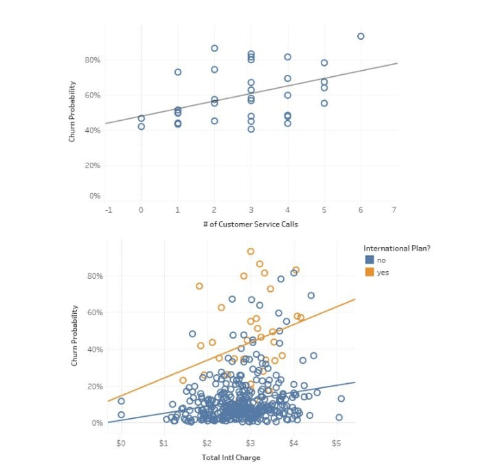
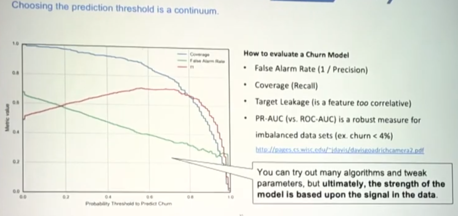
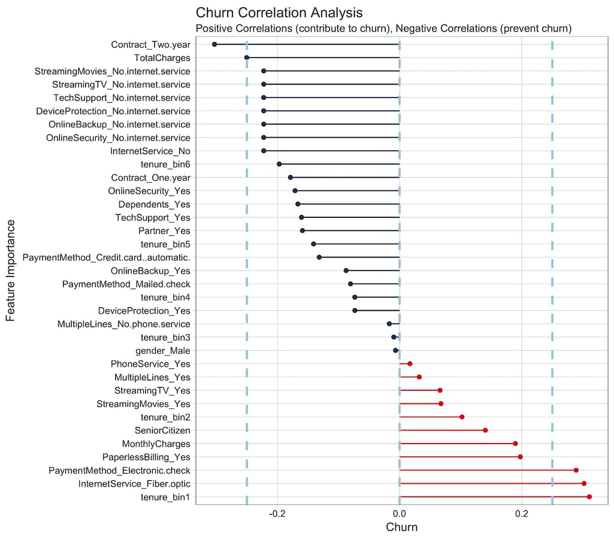
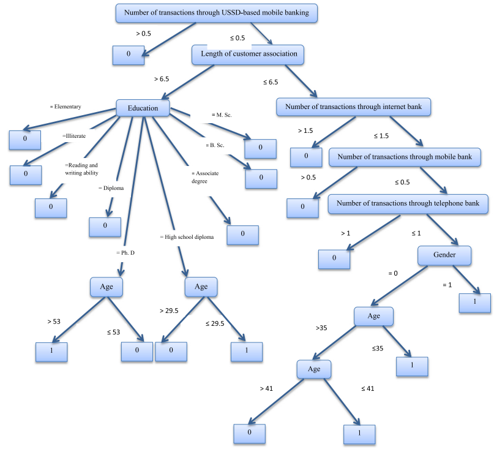
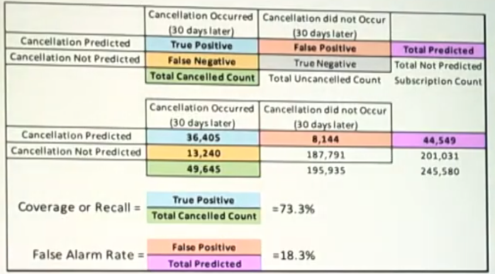

+++
date = "2022-01-09 05:20:35"
draft = false
title = "Telecom Churn Prediction MLOps"
description = "https://github.com/Muthukamalan/Customer-Churn-Prediction"
weight = 1
template = "page.html"

[taxonomies]
tags = ["Python","MLOps","Churn Prediction"]

[extra]
local_image = '/images/thumbnails/projects/churn-prediction.png'
quick_navigation_buttons = true
toc = false
+++

    
Table Of Content

    <!-- toc -->

# Introduction

It's easy to see every problem as an opportunity to use AI. Instead, let's start with the problem statement and determine whether AI is the right tool.

Let's Discuss the problem cycle before we jump into tools, solving technology is also good problem.

## Churn Prediction Problem 

Every Industrial problems should be evaluated from multiple feasibility perspectives before development begins.
- **Technical feasibility**  - assesses whether sufficient, high-quality data and appropriate tools are available or what tools needs to be useful.
- **Economic feasibility** determines whether the expected business benefits, such as reduced customer loss and increased retention.
- **Operational feasibility** evaluates whether the organization can effectively use 
- **Auditing & Governance feasibility**  focuses on establishing clear policies for data ownership, data sources, fairness and compliance thoughout it's lifecycle

Use Cases of Churn Prediction 
1. Stop-loss Intervention and Win-back Forensics
    - Identify customers who are likely to leave and take actionable items such as sending personalized emails, offering discounts, rewards just to encourage them to stay
    - Analyze who already done it and understand why they left how to get them back.
2. Understanding the Drivers of Churn
    - Help the business make improvements based on data rather than assumptions

### Business Phase
Know your KPI, Know your Data

| **KPI**                                   | **What it Measures**                                                     | **Why it Matters**                                                    |
| ----------------------------------------- | ------------------------------------------------------------------------ | --------------------------------------------------------------------- |
| **Gross Customer Churn Rate**             | Percentage of customers who leave during a given period.                 | Measures overall customer loss and retention performance.             |
| **Net Customer Churn Rate**               | Difference between new customer acquisitions and customer cancellations. | Indicates whether the customer base is growing or shrinking.          |
| **Daily Active Users (DAU)**              | Number of customers actively using the product each day.                 | Declining DAU can signal poor customer experience or potential churn. |
| **Weekly/Monthly Active Users (WAU/MAU)** | Number of customers active each week or month.                           | Measures long-term engagement and product adoption.                   |

### Data Phase
Sometime we may loss into complex understanding and data maturity, it may grow as 
1. *Business Domain and Requirements Discovery* – Understanding the business problem, objectives, stakeholders, and success criteria.
1. *ETL Project* – Collecting, cleaning, integrating, and preparing data from multiple sources or formulating implementation of the new workflow.(step 6)
1. *Data Engineering and Data Wrangling Projec*t – Building reliable data pipelines, transforming raw data, and ensuring data quality. In many organizations, this effort takes significantly more time than developing the machine learning model itself.
1. *Feature Engineering Project* – Creating meaningful features that capture customer behavior and improve model performance.
1. *Machine Learning Project* – Selecting algorithms, training models, evaluating performance, and optimizing predictions.
1. *Business Implementation Project* – Deploying the model into production and integrating predictions into business workflows, such as CRM systems or marketing campaigns.
1. *Results Assessment Project* – Monitoring model performance, measuring business impact, validating assumptions, and continuously improving the solution.

> [!NOTE]
> Build a standardized Advanced Analytics Data Model that is tailored to your business.

### Modeling Phase

Modeling aims to capture the relationship between customer behavior and churn. Most machine learning algorithms are fundamentally curve-fitting method at the EOD by learn relationship from historical data.

But What matters is the Actionable insights irrespective of ±0.0XX accuracy.

### Principles of Effective Metrics

* **Measure what matters.** Focus on a small set of meaningful metrics that drive decisions rather than tracking everything.
* **Connect metrics to people.** Metrics should be traceable to individual customers so that quantitative insights can be validated through real customer feedback.
* **Measure business outcomes.** Prioritize metrics that reflect business success, such as revenue, retention, or customer satisfaction, instead of intermediate metrics like clicks or page views.

### Evalution of Model 

| principle| Strategy | Description  | Example    |
|----------| ---------| -------------|----------- | 
| Listen continuously| Talk to Your Customers                     | Collect regular feedback to understand customer needs and pain points before they leave.                | Send customer satisfaction surveys, provide in-app feedback forms, or use live chat to gather suggestions.      |
| Fix root causes| Know Your Weaknesses                       | Identify product or service shortcomings and continuously improve them.                                 | A SaaS company discovers users struggle with onboarding and redesigns the onboarding experience.                |
| Position yourself| Focus on Your Competitive Advantage        | Reinforce the unique value your product offers compared to competitors.                                 | An online storage service reminds customers about its secure backup and cross-device synchronization features.  |
| Learn from cancellations| Understand Why Customers Cancel            | Capture cancellation reasons and analyze common patterns to reduce future churn.                        | Add an exit survey asking, "Why are you leaving?" with options like "Too expensive" or "Missing features."      |
| Educate customers| Improve Customer Education                 | Help customers realize the full value of your product through proactive guidance.                       | Send tutorial emails, onboarding videos, or feature walkthroughs after signup.                                  |
| Reinforce value| Reassure Customers of Your Product's Value | Regularly remind customers about new features and benefits so they don't overlook your product's value. | Include new feature announcements and success stories in newsletters or support responses.                      |

### Model Interpretation

---

# MLOps Life Cyle

MLOps supports every stage of the ML lifecycle—from data ingestion, feature engineering, model training, deployment, and inferencing to monitoring. 

This project builds an end-to-end Telecom Churn Prediction pipeline using DVC, Hydra, Optuna, MLflow, Docker, PostgreSQL, Prometheus, and Grafana for reproducibility, experiment tracking, deployment, and observability.

The primary objective is to show how modern MLOps tools work together to create a reproducible, scalable, and maintainable machine learning pipeline on  local setup using Docker compose.


flowchart TD

subgraph group_data["Data lifecycle"]
  node_raw["Raw Excel files source data [.gitkeep]"]
  node_prep["Ingestion preparation Python script"]
  node_postgres_init["Postgres initialization database bootstrap [init-db.sh]"]
  node_postgres[("Customer churn table PostgreSQL")]
  node_dvc["Versioned CSV export DVC artifact"]
end

subgraph group_ml["ML workflows"]
  node_train_config["Hydra train composition configuration [train.yaml]"]
  node_model_configs["Model variants Hydra model configs [default.yaml]"]
  node_training["Model training Python entry point [train.py]"]
  node_hparams_config["Tuning settings Hydra configuration [hparams.yaml]"]
  node_search_spaces["Model search spaces Optuna configs"]
  node_tuning["Hyperparameter tuning Python entry point [hparams.py]"]
end

subgraph group_runtime["Local runtime"]
  node_mlflow[("MLflow tracking experiment tracking")]
  node_minio[("MinIO artifact storage S3-compatible storage")]
  node_compose["Docker Compose local orchestrator [compose.local.yaml]"]
  node_prometheus["Prometheus metrics collection [prometheus.yaml]"]
  node_grafana["Grafana metrics visualization"]
  node_app_environment["Python application environment runtime definition [pyproject.toml]"]
end

node_raw -->|"prepare"| node_prep
node_prep -->|"produces ingestion-ready data"| node_postgres_init
node_postgres_init -->|"loads"| node_postgres
node_postgres -->|"DVC import/export"| node_dvc
node_train_config -->|"selects"| node_model_configs
node_train_config -->|"composes runtime config"| node_training
node_model_configs -->|"configures classifier"| node_training
node_dvc -->|"dataset input"| node_training
node_training -->|"logs runs and models"| node_mlflow
node_hparams_config -->|"controls trials"| node_tuning
node_search_spaces -->|"defines candidates"| node_tuning
node_model_configs -->|"tunes model family"| node_tuning
node_dvc -->|"dataset input"| node_tuning
node_tuning -->|"logs tuning runs"| node_mlflow
node_mlflow -->|"stores artifacts"| node_minio
node_compose -->|"starts service"| node_postgres
node_compose -->|"starts service"| node_mlflow
node_compose -->|"starts service"| node_minio
node_compose -->|"starts service"| node_prometheus
node_compose -->|"starts service"| node_grafana
node_prometheus -->|"metrics source"| node_grafana
node_app_environment -.->|"provides dependencies"| node_training
node_app_environment -.->|"provides dependencies"| node_tuning

click node_raw "https://github.com/muthukamalan/customer-churn-prediction/blob/main/data/raw/.gitkeep"
click node_prep "https://github.com/muthukamalan/customer-churn-prediction/blob/main/scripts/prep_db_ingestion.py"
click node_postgres_init "https://github.com/muthukamalan/customer-churn-prediction/blob/main/postgres/init-db.sh"
click node_dvc "https://github.com/muthukamalan/customer-churn-prediction/blob/main/customer_churn.csv.dvc"
click node_train_config "https://github.com/muthukamalan/customer-churn-prediction/blob/main/configs/train.yaml"
click node_model_configs "https://github.com/muthukamalan/customer-churn-prediction/blob/main/configs/model/default.yaml"
click node_training "https://github.com/muthukamalan/customer-churn-prediction/blob/main/src/train/train.py"
click node_hparams_config "https://github.com/muthukamalan/customer-churn-prediction/blob/main/configs/hparams.yaml"
click node_search_spaces "https://github.com/muthukamalan/customer-churn-prediction/blob/main/configs/hparams/random_forest_hparam.yaml"
click node_tuning "https://github.com/muthukamalan/customer-churn-prediction/blob/main/src/hparams/hparams.py"
click node_compose "https://github.com/muthukamalan/customer-churn-prediction/blob/main/compose.local.yaml"
click node_prometheus "https://github.com/muthukamalan/customer-churn-prediction/blob/main/prometheus/prometheus.yaml"
click node_app_environment "https://github.com/muthukamalan/customer-churn-prediction/blob/main/pyproject.toml"

classDef toneNeutral fill:#f8fafc,stroke:#334155,stroke-width:1.5px,color:#0f172a
classDef toneBlue fill:#dbeafe,stroke:#2563eb,stroke-width:1.5px,color:#172554
classDef toneAmber fill:#fef3c7,stroke:#d97706,stroke-width:1.5px,color:#78350f
classDef toneMint fill:#dcfce7,stroke:#16a34a,stroke-width:1.5px,color:#14532d
classDef toneRose fill:#ffe4e6,stroke:#e11d48,stroke-width:1.5px,color:#881337
classDef toneIndigo fill:#e0e7ff,stroke:#4f46e5,stroke-width:1.5px,color:#312e81
classDef toneTeal fill:#ccfbf1,stroke:#0f766e,stroke-width:1.5px,color:#134e4a
class node_raw,node_prep,node_postgres_init,node_postgres,node_dvc toneBlue
class node_train_config,node_model_configs,node_training,node_hparams_config,node_search_spaces,node_tuning toneAmber
class node_mlflow,node_minio,node_compose,node_prometheus,node_grafana,node_app_environment toneMint
